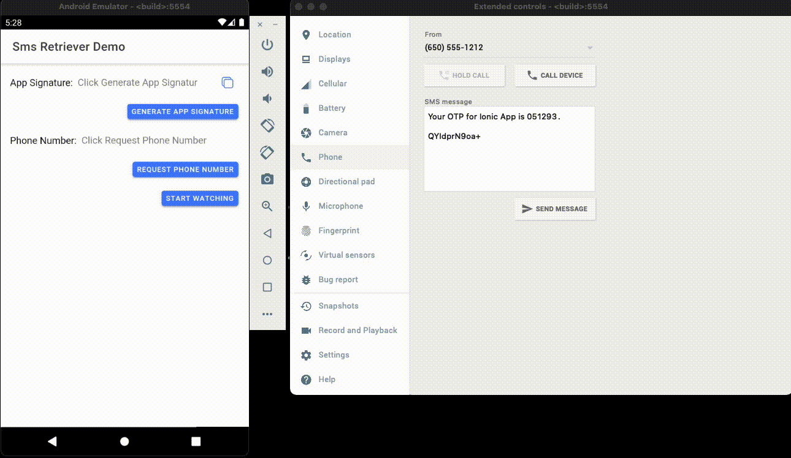

# capacitor-sms-retriever

With the [SMS Retriever API](https://developers.google.com/identity/sms-retriever/overview), you can perform SMS-based user verification in your Android app automatically, without requiring the user to manually type verification codes, and without requiring any extra app permissions.


<br/>
<br/>

<p align="center">

</p>

## Install

```bash
npm install capacitor-sms-retriever
npx cap sync
```

## API

<docgen-index>

* [`getAppSignature()`](#getappsignature)
* [`requestPhoneNumber()`](#requestphonenumber)
* [`startSmsReceiver()`](#startsmsreceiver)
* [`removeSmsReceiver()`](#removesmsreceiver)
* [`addListener('onSmsReceive', ...)`](#addlisteneronsmsreceive-)
* [Interfaces](#interfaces)

</docgen-index>

<docgen-api>
<!--Update the source file JSDoc comments and rerun docgen to update the docs below-->

### getAppSignature()

```typescript
getAppSignature() => Promise<AppSignature>
```

This is a helper method to generate your message hash to be included in your SMS message.
Without the correct hash, your app won't receive the message callback. This only needs to be generated once per app and stored.

Note: Do not use hash strings dynamically computed on the client in your verification messages.

**Returns:** <code>Promise&lt;<a href="#appsignature">AppSignature</a>&gt;</code>

**Since:** 0.1.0

--------------------


### requestPhoneNumber()

```typescript
requestPhoneNumber() => Promise<HintPhoneNumber>
```

Initiate hint picker to prompt the user to choose from the phone numbers stored on the device.

**Returns:** <code>Promise&lt;<a href="#hintphonenumber">HintPhoneNumber</a>&gt;</code>

**Since:** 0.1.0

--------------------


### startSmsReceiver()

```typescript
startSmsReceiver() => Promise<RegisterReceiver>
```

Start to listen for SMS messages.

**Returns:** <code>Promise&lt;<a href="#registerreceiver">RegisterReceiver</a>&gt;</code>

**Since:** 0.1.0

--------------------


### removeSmsReceiver()

```typescript
removeSmsReceiver() => Promise<void>
```

Stop to listen for SMS messages.

**Since:** 0.1.0

--------------------


### addListener('onSmsReceive', ...)

```typescript
addListener(eventName: 'onSmsReceive', listenerFunc: (receivedMessage: ReceivedMessage) => void) => Promise<PluginListenerHandle> & PluginListenerHandle
```

Listen for when SMS is coming

| Param              | Type                                                                                      |
| ------------------ | ----------------------------------------------------------------------------------------- |
| **`eventName`**    | <code>'onSmsReceive'</code>                                                               |
| **`listenerFunc`** | <code>(receivedMessage: <a href="#receivedmessage">ReceivedMessage</a>) =&gt; void</code> |

**Returns:** <code>Promise&lt;<a href="#pluginlistenerhandle">PluginListenerHandle</a>&gt; & <a href="#pluginlistenerhandle">PluginListenerHandle</a></code>

**Since:** 0.1.0

--------------------


### Interfaces


#### AppSignature

| Prop            | Type                | Description    | Since |
| --------------- | ------------------- | -------------- | ----- |
| **`signature`** | <code>string</code> | App signature. | 0.1.0 |


#### HintPhoneNumber

| Prop              | Type                | Description                | Since |
| ----------------- | ------------------- | -------------------------- | ----- |
| **`phoneNumber`** | <code>string</code> | Phone number user selected | 0.1.0 |


#### RegisterReceiver

| Prop               | Type                 | Description                                  | Since |
| ------------------ | -------------------- | -------------------------------------------- | ----- |
| **`isRegistered`** | <code>boolean</code> | Returns if register receiver started or not. | 0.1.0 |


#### PluginListenerHandle

| Prop         | Type                                      |
| ------------ | ----------------------------------------- |
| **`remove`** | <code>() =&gt; Promise&lt;void&gt;</code> |


#### ReceivedMessage

| Prop          | Type                | Description                | Since |
| ------------- | ------------------- | -------------------------- | ----- |
| **`message`** | <code>string</code> | Received message with hash | 0.1.0 |
| **`error`**   | <code>string</code> | In case of any error       | 0.1.0 |

</docgen-api>
